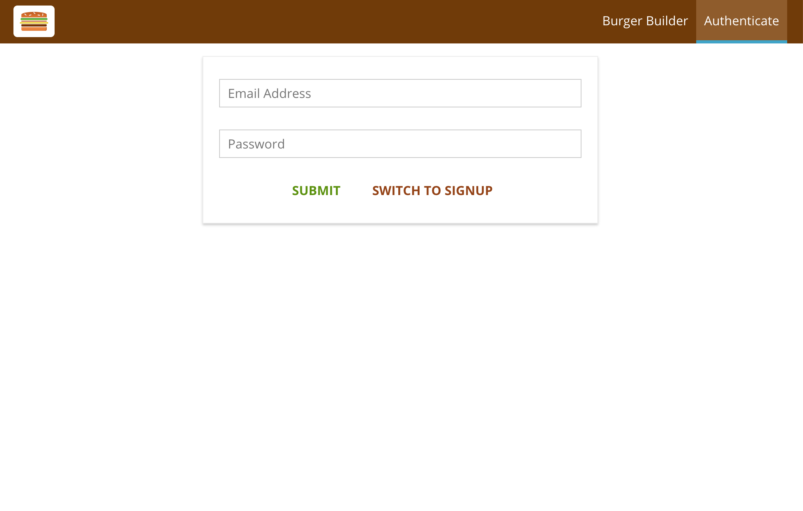
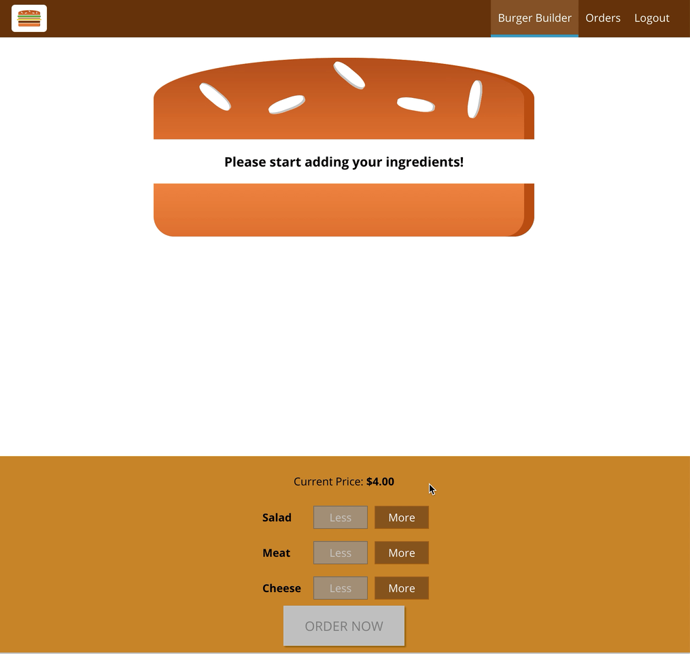
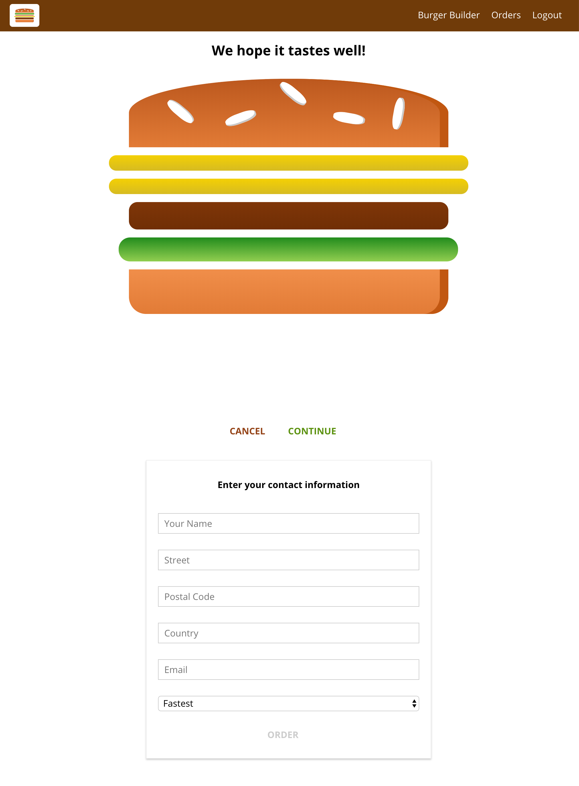
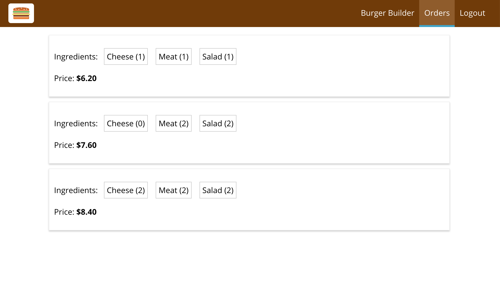
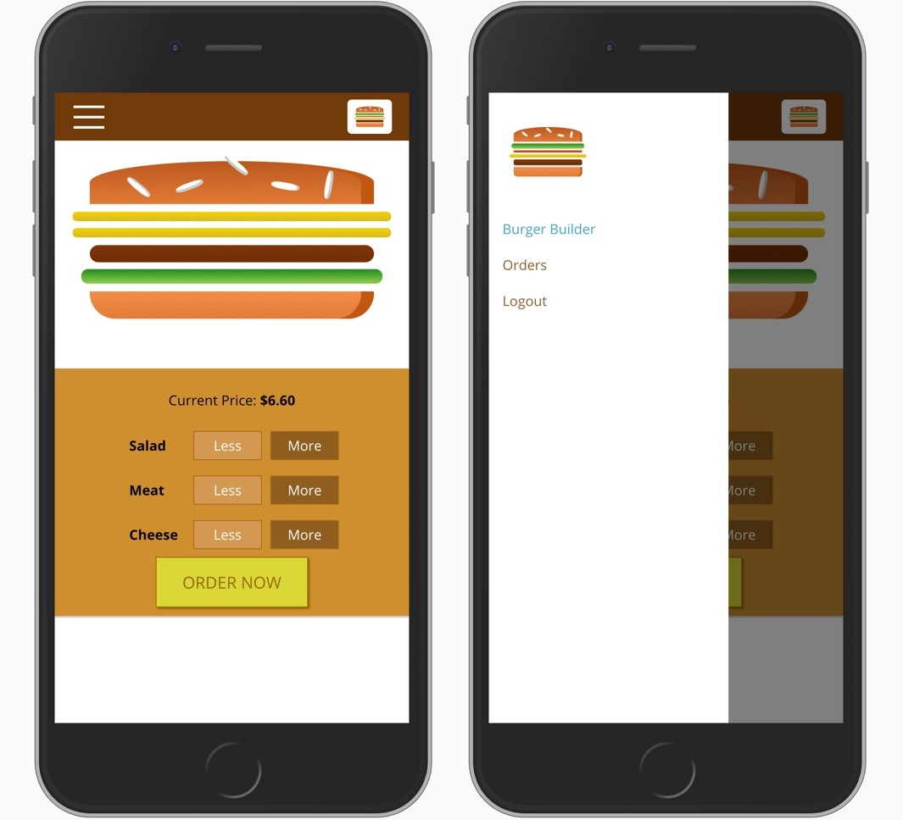

# Burger Builder

Hello!

This is a simple React JS application that simulates ordering a customized burger and sending order to the restaurant for fulfillment. The app is deployed on [**Firebase**](https://burger-builder-12ed4.firebaseapp.com/). This project is part of the **Udemy React course** by **Maximilian Schwarzmüller**. This is my first React app.

## Technologies
* HTML 5
* CSS 3
* SASS
* React JS
* Redux
* React Router
* Axios JS
* Webpack
* NPM
* Visual Studio Code

## App Preview

### Login / Signup Page



---

### Burger Builder Page



---

### Checkout Page



---

### Orders Page



---

### Mobile



## Deployment 

This app is deployed on [**Firebase**](https://burger-builder-12ed4.firebaseapp.com/). The backend for the app is also managed by Firebase including **Realtime Database** and **Authentication**. 

A **package.json** file has been set up with all the dependencies needed for this app:

``` json
{
  "name": "burger-builder",
  "version": "0.1.0",
  "private": true,
  "dependencies": {
    "@testing-library/jest-dom": "^4.2.4",
    "@testing-library/react": "^9.4.0",
    "@testing-library/user-event": "^7.2.1",
    "axios": "^0.19.2",
    "node-sass": "^4.13.1",
    "prop-types": "^15.7.2",
    "react": "^16.12.0",
    "react-dom": "^16.12.0",
    "react-redux": "^7.1.3",
    "react-router-dom": "^5.1.2",
    "react-scripts": "3.3.1",
    "redux": "^4.0.5",
    "redux-thunk": "^2.3.0"
  },
  "scripts": {
    "start": "react-scripts start",
    "build": "react-scripts build",
    "test": "react-scripts test",
    "eject": "react-scripts eject"
  },
  "browserslist": {
    "production": [
      ">0.2%",
      "not dead",
      "not op_mini all"
    ],
    "development": [
      "last 1 chrome version",
      "last 1 firefox version",
      "last 1 safari version"
    ]
  },
  "devDependencies": {
    "babel-eslint": "^9.0.0",
    "eslint": "^5.16.0",
    "eslint-config-airbnb": "^17.1.1",
    "eslint-config-prettier": "^4.3.0",
    "eslint-config-wesbos": "0.0.19",
    "eslint-plugin-html": "^5.0.5",
    "eslint-plugin-import": "^2.20.1",
    "eslint-plugin-jsx-a11y": "^6.2.3",
    "eslint-plugin-prettier": "^3.1.2",
    "eslint-plugin-react": "^7.18.2",
    "eslint-plugin-react-hooks": "^1.7.0",
    "prettier": "^1.19.1"
  }
}

```

----
**Note**: This app was created for demo purposes only.